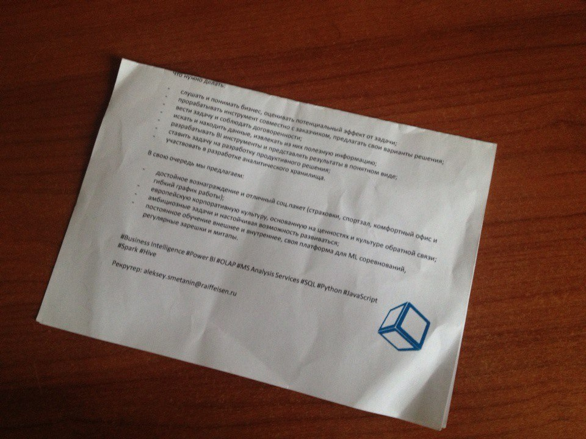
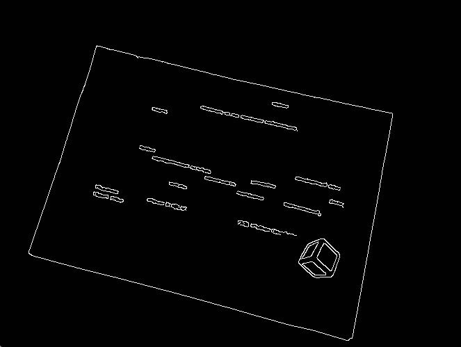
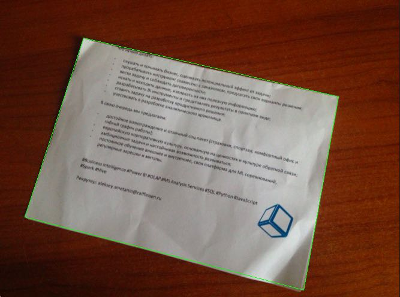

# Программа для сканирования бумаг

## Функциональность
Данный скрипт находит по детектору границ Канни на фотографии лист бумаги или чек (если он прямоугольной формы).

### Пример функционирования    

## Запуск на MacOS    
1. Запустить `Терминал`     
2. Ввести `python3 scan.py`

(Выполнено в качестве учебной задачи на pyimagesearch.com)

