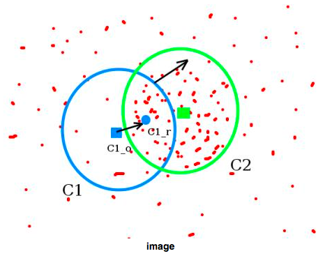

# Сдвиг окна для нахождения объектов в видеопотоке

*Алгоритм:*          
В каком-то месте картинки инициализируется окно определенного размера. Оно итерационно "ищет" места, где плотность пикселей выше - и перемещает центр туда. В результате окно находит по сгустку точек необходимый объект.       
Подробнее: https://is.gd/lQWiPp

